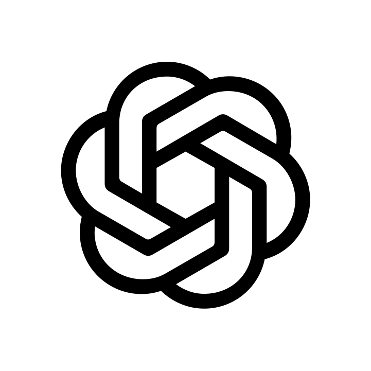

어느 날 AI를 잘 모르는 사람이 와서 묻는다고 해보자.

> **"우리 시스템에 AI가 왜 필요한가요?"**  
> **"Agent는 또 왜 필요한가요?"**  
> **"그래서 여기에 왜 투자해야 하죠?"**

결국 이 질문에 답할 수 있어야 한다.

어쩌면 Agent를 잘 만드는 것만큼이나 중요한 능력일지도 모른다.

아무리 성능 좋은 Agent를 만들고 Eval을 잘 설계해도, **왜 이 문제를 Agent로 풀어야 하는지 설명할 수 없다면 비즈니스로 이어지기 어렵다.**

반대로 이 질문에 답할 수 있다면 이야기가 달라진다. 어떤 문제가 Agent에 적합한지 고민할 수 있고, Agent에게 어디까지 판단을 맡길지, 어디까지 행동하게 할지도 생각해볼 수 있다.

조금 노골적으로 말하면,

**Agent를 이해하는 것은 돈이 된다.**

그런데 누군가에게 "왜 Agent인가?"를 설명하려면 그보다 먼저 답해야 할 질문이 하나 있다.

> **그래서 Agent가 뭔데?**

## LLM에서 Agent로

LLM은 처음부터 Agent였던 것은 아니다.

Agent라는 관점에서 LLM의 변화를 돌아보면 개인적으로 두 가지가 눈에 들어온다.

하나는 **Context**다.

In-context Learning을 통해 모델의 Parameter를 직접 수정하지 않고도 Prompt와 Example을 Context로 제공해 새로운 Task를 수행할 수 있게 되었다.

이후 Retrieval, Memory, Skill처럼 모델이 문제를 해결할 때 참고할 수 있는 정보를 외부에서 제공하는 방법도 다양해졌다.

```
             Context

Prompt / Few-shot
Retrieval
Memory
Skill
   │
   ▼
  LLM
```

모델 자체만큼이나 **모델에게 무엇을 보여줄 것인가**도 중요해진 것이다.

다른 하나는 **Action**이다.

LLM은 Text를 생성하는 것을 넘어 검색하고, 코드를 실행하고, API를 호출할 수 있게 되었다.

```
Reasoning
    ↓
Tool Use
    ↓
 Action
    ↓
Observation
```

그리고 행동의 결과는 다시 새로운 Context가 된다.

```
Context
   ↓
Reasoning
   ↓
Action
   ↓
Observation
   ↓
Reasoning
   ↓
...
```

이제 LLM은 질문에 한 번 답하고 끝나는 대신, 결과를 관찰하고 다시 판단하며 여러 단계에 걸쳐 하나의 Task를 수행할 수 있다.

우리는 이런 시스템을 흔히 **Agent**라고 부른다.

문제는 그 경계가 생각보다 모호하다는 데 있다.

Tool을 사용한다고 모두 Agent라고 부르기는 어렵다. LLM이 여러 Tool 중 하나를 선택하거나 Workflow 중간에서 판단을 내리는 시스템도 마찬가지다.

어디서부터 Agent라고 불러야 하는지 생각하다 보니, 먼저 Agent를 만드는 회사들은 이 경계를 어떻게 바라보고 있는지 궁금해졌다.

## OpenAI가 바라보는 Agent

OpenAI는 Agent를 **사용자를 대신해 Task를 독립적으로 수행하는 시스템**으로 설명한다.

처음에는 이 설명만으로 조금 모호하게 느껴졌다. 그런데 OpenAI의 <a href="https://openai.com/business/guides-and-resources/a-practical-guide-to-building-ai-agents/" target="_blank" rel="noopener noreferrer"> *A practical guide to building agents*</a>를 읽어보면 조금 더 분명한 기준이 나온다.
단순히 LLM을 사용하는지가 아니라, **LLM이 Workflow의 실행을 관리하고 의사결정을 내리는지**를 구분해서 보고 있다.

예를 들어 Chatbot이나 Sentiment Classifier도 LLM을 사용할 수 있다. Workflow 중간에 LLM을 넣어 특정 판단을 맡길 수도 있다.

하지만 실행 과정 자체가 Application에 의해 정해져 있다면 OpenAI는 이런 시스템을 Agent와 구분한다.

반대로 Agent에서는 LLM이 현재 상황을 바탕으로 Tool을 선택하고, 그 결과를 확인하고, 다음 행동을 결정한다. 필요하다면 행동을 수정하고 언제 Task가 완료되었는지도 판단한다.

LLM이 단순히 Workflow의 한 부분으로 사용되는 것과 **Workflow의 실행을 직접 관리하는 것** 사이에 차이를 두는 셈이다.

## Anthropic이 구분하는 Workflow와 Agent

Anthropic의 설명에서는 이 차이가 조금 더 직접적으로 드러난다.

Anthropic은 <a href="https://www.anthropic.com/engineering/building-effective-agents" target="_blank" rel="noopener noreferrer"> *Building effective agents*</a>에서 LLM을 활용하는 시스템을 넓게 Agentic System으로 바라보면서, 그 안에서 **Workflow와 Agent를 구분한다.**

Workflow에서는 LLM과 Tool이 미리 정의된 Code Path를 따라 실행된다.

<div class="not-prose my-8 overflow-x-auto rounded-2xl" role="group" aria-label="Input에서 LLM 1과 Gate를 거쳐 Next이면 LLM 2로, Stop이면 Output으로 이동하며 LLM 2도 Output으로 연결된다. 모바일에서는 가로로 스크롤할 수 있습니다.">


</div>

<details>
<summary>다이어그램 원본 보기 (Mermaid)</summary>

```text
flowchart LR
    I["Input"] --> L1["LLM 1"]
    L1 --> G{"Gate"}

    G -->|"Next"| L2["LLM 2"]
    G -->|"Stop"| O["Output"]

    L2 --> O
```

</details>

반면 Agent에서는 LLM이 Task를 수행하는 과정과 Tool 사용을 동적으로 결정한다.

<div class="not-prose my-8 overflow-x-auto rounded-2xl" role="group" aria-label="Goal을 받은 LLM이 Environment에 Action을 수행하고 Observation을 받아 다시 판단하며 Task Complete 시 Result를 반환하는 구조. 모바일에서는 가로로 스크롤할 수 있습니다.">


</div>

<details>
<summary>다이어그램 원본 보기 (Mermaid)</summary>

```text
flowchart LR
    G["Goal"] --> L["LLM"]

    L -->|"Action"| E["Environment"]
    E -->|"Observation"| L

    L -->|"Task Complete"| R["Result"]
```

</details>

계획하고 행동한 뒤 결과를 관찰하고, 그 결과를 바탕으로 다시 다음 행동을 결정한다.

미리 정해진 길을 따라가는 대신 **현재 상황에 맞춰 Goal에 도달하기 위한 과정을 만들어간다.**

Anthropic은 동시에 모든 문제를 Agent로 만들 필요는 없다고 이야기한다. Agent는 유연한 대신 비용과 Latency가 증가하고 동작을 예측하기 어려워질 수 있기 때문이다.

가능하다면 단순한 해결책부터 시작하고, 그 정도로 해결되지 않는 문제에서 Agent를 고려하라는 것이다.

두 회사의 표현에는 차이가 있지만, 공통적으로 눈에 들어온 부분이 있었다.

**LLM을 사용했는지가 아니라, 문제를 해결하는 과정에서 LLM이 무엇을 결정하고 있는가.**

이 지점에서 Agent를 바라보는 나름의 기준을 생각해볼 수 있었다.

## 문제 해결 과정의 Ownership

처음에는 나도 Tool을 사용하는 것이 Agent의 중요한 특징이라고 생각했다.

그런데 여러 구조를 생각해보니 Tool만으로는 설명되지 않는 경우가 계속 생겼다.

잘 만들어진 Workflow도 LLM을 사용할 수 있다. 수십 개의 Tool을 가지고 있을 수도 있고, LLM이 상황을 보고 그중 하나를 선택하게 만들 수도 있다.

반대로 Agent에게 사용할 수 있는 Tool을 제한하고, Skill을 통해 상당히 구체적인 Procedure를 알려줄 수도 있다.

Tool의 개수나 행동의 자유도만으로 Agent와 Workflow를 나누기에는 무언가 부족했다.

여러 경우를 생각하다 보니 내가 더 중요하게 보게 된 것은 **문제 해결 과정의 책임이 어디에 있는가**였다.

나는 이걸 **Ownership**이라고 생각해보기로 했다.

Application이 다음에 무엇을 해야 하는지 대부분 결정하고 LLM은 정해진 위치에서 필요한 판단만 수행한다면, 문제 해결 과정의 Ownership은 여전히 Application에 가깝다.

반대로 Application은 Goal과 사용할 수 있는 Capability를 제공하고, 그 안에서 무엇을 해야 할지 판단하고 행동의 결과를 관찰하며 다음 행동을 결정하는 책임을 LLM에게 넘길 수도 있다.

현재 나는 후자에 가까워질수록 Agent라고 생각한다.

그래서 지금은 Agent를 이렇게 바라보고 있다.

> **Agent는 주어진 Goal을 달성하기 위해, 문제 해결 과정의 Ownership을 위임받은 주체다.**

여기서 말하는 Ownership은 모든 것을 마음대로 결정할 수 있다는 뜻은 아니다.

Application이 Goal과 행동할 수 있는 범위를 정해줄 수도 있고, 사용할 수 있는 Tool을 제한할 수도 있다. 특정 행동에는 Approval을 요구할 수 있고, Skill을 통해 문제 해결에 필요한 Procedure를 제공할 수도 있다. 잘 만들어진 Workflow를 하나의 Capability처럼 사용하게 할 수도 있다.

```
Goal
 ↓
Agent
 ├─ Tool
 ├─ Skill
 ├─ Workflow
 └─ Human
```

이런 제약과 Capability 안에서 Agent는 현재 상황을 관찰하고, 무엇을 해야 할지 판단하고, 행동의 결과를 바탕으로 다시 다음 행동을 결정한다.

내가 중요하게 보는 것은 개별 Tool을 선택할 수 있는지, 얼마나 자유롭게 행동할 수 있는지가 아니다.

**Goal을 향해 이어지는 문제 해결 과정의 판단과 책임을 누가 가지고 있는가.**

현재는 그 차이가 Agent를 바라보는 가장 중요한 기준이라고 생각한다.

## Workflow와 Agent 사이

간단한 고객 문의를 하나 생각해보자.

고객이 다음과 같은 문의를 남겼다.

> **"결제가 두 번 됐어요."**

회사에는 이미 잘 만들어진 고객 대응 시스템이 있다.

LLM이 고객의 문의를 분류하고, 분류 결과에 따라 적절한 Workflow를 선택한다.

<div class="not-prose my-8 overflow-x-auto rounded-2xl" role="group" aria-label="고객 문의를 받은 Application의 LLM Routing이 중복 결제, 결제 실패, 결제 취소 Workflow 중 하나를 선택하고 고객 응대로 연결한다. 모바일에서는 가로로 스크롤할 수 있습니다.">


</div>

<details>
<summary>다이어그램 원본 보기 (Mermaid)</summary>

```text
flowchart LR
    subgraph APP["Application"]
        L["LLM Routing"]

        L --> W1["중복 결제 Workflow"]
        L --> W2["결제 실패 Workflow"]
        L --> W3["결제 취소 Workflow"]
    end

    Q["고객 문의"] --> L
    W1 --> R["고객 응대"]
    W2 --> R
    W3 --> R
```

</details>

여기에도 LLM과 Tool이 모두 사용된다.

고객 문의가 다양하다면 수십 개의 Workflow 중 어떤 것을 실행할지 LLM이 직접 선택하게 만들 수도 있다.

하지만 내 관점에서 이 시스템의 문제 해결 과정은 여전히 Application에 가깝다.

LLM이 어떤 길로 들어갈지를 결정하기는 하지만, 그 이후 어떤 순서로 문제를 해결할지, 어떤 결과에서 다음 단계로 넘어갈지, 언제 끝낼지는 이미 Workflow에 정의되어 있기 때문이다.

이번에는 조금 다른 시스템을 생각해보자.

Application은 Agent에게 하나의 **Goal**을 주고, 결제 내역 조회, 환불 정책 조회, 고객 정보 확인 같은 Tool을 제공한다.

> **"고객의 결제 문제를 해결하라."**

<div class="not-prose my-8 overflow-x-auto rounded-2xl" role="group" aria-label="결제 문제 해결 Goal을 받은 Agent가 Tool에 Action을 수행하고 Observation을 받아 다시 판단하며 Goal 달성 시 종료한다. 모바일에서는 가로로 스크롤할 수 있습니다.">


</div>

<details>
<summary>다이어그램 원본 보기 (Mermaid)</summary>

```text
flowchart LR
    G["Goal<br/>고객의 결제 문제를 해결하라"] --> A["Agent"]

    A -->|"Action"| T["Tool<br/>결제 내역 조회 · 고객 정보 확인 · 환불"]
    T -->|"Observation"| A

    A -->|"Goal 달성"| E["종료"]
```

</details>

이번에는 문제를 해결하는 과정 전체가 미리 정해져 있지 않다.

Agent는 현재까지 얻은 정보를 보고 무엇을 확인할지 판단한다. 행동의 결과를 보고 다시 다음 행동을 결정하고, Goal에 도달했다고 판단할 때까지 이 과정을 이어간다.

내가 생각하는 Ownership의 차이는 이런 모습에 가깝다.

다만 두 번째 시스템이 Agent에 더 가깝다고 해서 **더 좋은 시스템이라는 뜻은 아니다.**

고객 문의 대부분을 몇 개의 안정적인 Workflow로 해결할 수 있다면 첫 번째 시스템이 훨씬 나을 수도 있다.

굳이 Agent에게 판단을 넘겼다가 비용과 Latency만 늘고 예상하지 못한 실패가 생길 수도 있다.

그래서 Agent의 경계를 고민하면서 두 가지 문제를 따로 보게 되었다.

하나는 **어떤 시스템을 Agent라고 볼 것인가**에 대한 문제이고, 다른 하나는 **그 문제를 실제로 Agent에게 맡길 가치가 있는가**에 대한 문제다.

둘은 비슷해 보이지만 전혀 다른 이야기다.

> **Agent라고 부를 수 있는 것과, Agent로 만들어야 하는 것은 다르다.**

## Agent를 설계한다는 것

사실 Agent의 정확한 사전적 정의를 만드는 것 자체가 목적은 아니다.

직접 Agent를 공부하고 만들어보니 그보다 현실적인 문제들이 계속 등장했다.

Application이 결정해야 할 영역이 있고 Agent에게 맡길 수 있는 판단이 있다. 사용할 Tool과 행동할 수 있는 범위를 정해야 하고, 위험한 행동에는 사람의 승인을 요구할 수도 있다.

Skill이 Agent에게 어느 정도까지 Procedure를 제공할지도 결정해야 한다. 어떤 문제는 Agent에게 맡기기보다 아예 Workflow로 고정하는 편이 나을 수도 있다.

처음에는 서로 다른 설계 문제처럼 보였다.

지금은 이 문제들이 결국 하나의 지점에서 만난다고 생각한다.

> **Application과 Agent 사이에서 문제 해결의 책임을 어떻게 나눌 것인가.**

Ownership이라는 관점이 내게 필요했던 이유도 여기에 있다.

Agent가 무엇인지 생각해보는 일은 결국 **Agent에게 무엇을 맡길 것인지 생각하는 일**과 연결되어 있었다.

물론 지금의 생각이 최종 답이라고 생각하지는 않는다.

앞으로 더 많은 Agent를 만들고 여러 문제를 다뤄보면 지금의 정의가 부족하다고 느낄 수도 있다. 그때는 다시 고치면 된다.

지금은 **어떤 문제 해결의 책임을 Agent에게 맡길 것인지, 그리고 그 책임을 Agent에게 맡길 이유가 있는지**를 기준으로 Agent를 바라보려고 한다.

아마 앞으로 Agent를 공부하면서도 계속 돌아오게 될 기준일 것 같다.