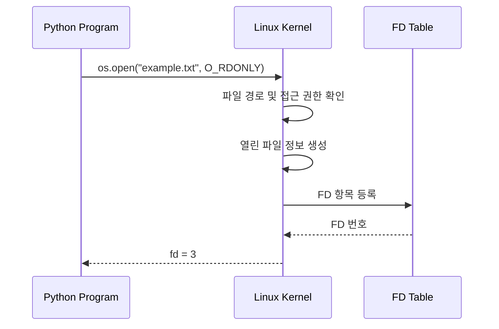

---

title: "03. File Descriptor는 무엇을 가리키는가"
description: "File Descriptor의 개념과 프로세스의 FD 테이블, 커널의 열린 파일 정보, Python의 open, read, write, close 동작을 이해합니다."
pubDatetime: 2026-09-29T09:20:00+09:00
tags:

- Python
- Python으로 이해하는 운영체제
- File Descriptor
- File System
- System Call

draft: False

---

02편에서는 Python 프로그램이 System Call을 통해 커널에 작업을 요청하고 결과를 돌려받는 과정을 살펴봤다.

그 과정에서 다음과 같은 코드를 사용했다.

```python
import os

fd = os.open("example.txt", os.O_RDONLY)
data = os.read(fd, 100)
os.close(fd)
```

여기서 `os.read()`는 파일의 경로가 아니라 `fd`라는 정수를 전달받는다.

커널은 단순한 정수만 전달받고도 어떤 파일에서 데이터를 읽어야 하는지 어떻게 알 수 있을까?

이를 이해하려면 File Descriptor와 프로세스의 FD 테이블, 그리고 커널이 관리하는 열린 파일 정보를 알아야 한다.

이번 편에서는 File Descriptor의 구조를 살펴보고, Python의 `os.open()`, `os.read()`, `os.write()`, `os.close()`가 어떤 역할을 하는지 알아본다.

---

## 1. File Descriptor란 무엇인가?

File Descriptor(FD)는 프로세스가 열린 파일 등의 I/O 자원을 참조하기 위해 사용하는 음수가 아닌 정수 식별자다.

Linux에서는 일반 파일뿐만 아니라 Pipe, Socket 등 다양한 I/O 자원에 FD를 사용한다.

예를 들어 다음 코드를 실행해 보자.

```python
import os

fd = os.open("example.txt", os.O_RDONLY)

print(fd)

os.close(fd)
```

실행 결과는 다음과 같을 수 있다.

```text
3
```

`os.open()`은 파일을 열고 해당 파일을 참조할 수 있는 FD를 반환한다.

여기서 `3`이라는 숫자는 파일의 고유한 식별자가 아니다.

현재 프로세스의 FD 테이블에서 열린 파일을 찾기 위한 번호다.

따라서 서로 다른 프로세스에서 동일한 FD 번호를 사용하더라도 반드시 같은 파일을 가리키는 것은 아니다.

반대로 동일한 파일을 여러 번 열면 서로 다른 FD가 반환될 수도 있다.

FD의 의미를 정확히 이해하려면 커널이 이를 어떻게 관리하는지 살펴봐야 한다.

---

## 2. FD 테이블은 어떻게 동작하는가?

Linux에서 각 프로세스는 자신이 사용하는 FD를 관리하는 테이블을 가진다.

이를 FD 테이블(File Descriptor Table)이라고 한다.

FD 테이블의 각 항목은 커널이 관리하는 열린 파일 정보(Open File Description)를 참조한다.

이 열린 파일 정보에는 현재 파일 위치(File Offset), 접근 모드 등의 상태가 저장된다.

일반 파일의 경우 열린 파일 정보는 파일의 메타데이터를 관리하는 커널의 파일 시스템 객체와 연결된다.

전체 구조를 단순화하면 다음과 같다.


<details>
<summary>다이어그램 원본 보기 (Mermaid)</summary>

```text
flowchart LR
    subgraph P["Process · User Space"]
        A["Python Program<br/>fd1 = 3 · fd2 = 4"]
        subgraph T["File Descriptor Table · process-local"]
            B["FD 3"]
            C["FD 4"]
        end
    end

    subgraph K["Linux Kernel"]
        D["Open File Description A<br/>offset: 0 · O_RDONLY"]
        E["Open File Description B<br/>offset: 0 · O_RDONLY"]
        F["File Metadata<br/>example.txt · same inode"]
    end

    A --> B
    A --> C
    B --> D
    C --> E
    D --> F
    E --> F
```

</details>

이 그림에서는 FD 3과 FD 4가 서로 다른 열린 파일 정보를 참조하지만, 최종적으로 동일한 파일과 연결되어 있다.

예를 들어 같은 파일을 두 번 열면 이러한 구조가 만들어질 수 있다.

```python
import os

fd1 = os.open("example.txt", os.O_RDONLY)
fd2 = os.open("example.txt", os.O_RDONLY)

print(fd1, fd2)

os.close(fd1)
os.close(fd2)
```

두 번의 `os.open()`은 일반적으로 서로 다른 열린 파일 정보를 생성한다.

따라서 같은 파일을 열었더라도 각각 독립적인 파일 위치를 가질 수 있다.

반면 `os.dup()`으로 FD를 복제하면 서로 다른 FD가 동일한 열린 파일 정보를 공유한다.

이 경우 두 FD는 파일 위치도 공유한다.

이 차이는 이후 표준 입출력 리다이렉션과 Pipe를 이해할 때 중요하다.

---

## 3. 파일을 열면 어떤 일이 일어나는가?

다음 코드를 살펴보자.

```python
import os

fd = os.open("example.txt", os.O_RDONLY)
```

`os.open()`은 Python에서 운영체제의 파일 열기 기능을 사용하기 위한 함수다.

Linux에서는 일반적으로 `openat()`과 같은 시스템 호출로 이어질 수 있다.

파일을 열 때 커널은 전달받은 경로와 접근 권한 등을 확인한다.

파일 열기에 성공하면 커널은 열린 파일 정보를 생성하고, 프로세스의 FD 테이블에 해당 정보를 참조하는 항목을 등록한다.

그다음 FD 번호를 반환한다.



이 그림은 개념적인 흐름을 단순화한 것이다. FD 테이블은 커널이 관리하는 프로세스별 자료구조이며, 독립적인 서비스나 프로세스가 아니다.

여기서 중요한 점은 FD가 파일 경로를 직접 저장하는 번호가 아니라는 것이다.

FD는 프로세스의 FD 테이블을 통해 커널의 열린 파일 정보와 연결된다.

---

## 4. read()와 write()는 어떻게 동작하는가?

파일을 열어 FD를 얻었다면 이를 이용해 데이터를 읽거나 쓸 수 있다.

### read(): 파일에서 데이터 읽기

다음 코드를 살펴보자.

```python
import os

fd = os.open("example.txt", os.O_RDONLY)

data = os.read(fd, 5)

print(data)

os.close(fd)
```

`os.read(fd, 5)`는 FD가 참조하는 열린 파일에서 최대 5바이트를 읽는다.

커널은 FD 테이블을 통해 해당 FD가 어떤 열린 파일 정보를 참조하는지 확인한다.

일반 파일에서는 열린 파일 정보에 저장된 현재 파일 위치를 기준으로 데이터를 읽고, 실제로 읽은 바이트 수만큼 파일 위치를 이동시킨다.

예를 들어 파일 내용이 다음과 같다고 가정해 보자.

```text
Hello, World!
```

이때 다음 코드를 실행하면 어떤 결과가 나올까?

```python
import os

fd = os.open("example.txt", os.O_RDONLY)

first = os.read(fd, 5)
second = os.read(fd, 5)

print(first)
print(second)

os.close(fd)
```

결과는 다음과 같다.

```text
b'Hello'
b', Wor'
```

첫 번째 `read()`에서 5바이트를 읽었기 때문에 파일 위치가 이동했다.

두 번째 `read()`는 처음부터 다시 읽는 것이 아니라 변경된 파일 위치에서 이어서 읽는다.

참고로 `os.read()`는 문자열이 아닌 `bytes` 객체를 반환한다.

### write(): 파일에 데이터 쓰기

이번에는 파일에 데이터를 써 보자.

```python
import os

fd = os.open(
    "output.txt",
    os.O_WRONLY | os.O_CREAT | os.O_TRUNC,
    0o644,
)

os.write(fd, b"Hello, OS!")

os.close(fd)
```

`os.open()`에 전달한 플래그의 의미는 다음과 같다.

| 플래그        | 의미                    |
| ---------- | --------------------- |
| `O_WRONLY` | 쓰기 전용으로 열기            |
| `O_CREAT`  | 파일이 없으면 생성            |
| `O_TRUNC`  | 기존 파일이 있으면 길이를 0으로 변경 |

`os.write()`는 FD가 참조하는 파일에 바이트 데이터를 기록하도록 요청한다.

일반 파일에서는 기록된 바이트 수에 따라 파일 위치도 변경된다.

단, `os.write()`가 요청한 데이터를 항상 한 번에 모두 기록하는 것은 아니다. 실제 기록한 바이트 수를 반환하므로, 필요한 경우 반환값을 확인하고 남은 데이터를 추가로 써야 한다.

또한 `os.write()`가 성공했다고 해서 데이터가 즉시 물리적 저장장치에 영구 저장되었다는 의미는 아니다.

---

## 5. close()는 무엇을 종료하는가?

파일 사용이 끝나면 FD를 닫아야 한다.

```python
os.close(fd)
```

`os.close()`는 프로세스의 FD 테이블에서 해당 FD를 해제하도록 요청한다.

하지만 FD를 닫는다고 해서 파일 자체가 삭제되는 것은 아니다.

또한 여러 FD가 동일한 열린 파일 정보를 공유하고 있다면, 하나의 FD를 닫더라도 다른 FD를 통해 계속 접근할 수 있다.

이를 Python 코드로 확인해 보자.

```python
import os

fd1 = os.open("example.txt", os.O_RDONLY)
fd2 = os.dup(fd1)

os.close(fd1)

data = os.read(fd2, 5)
print(data)

os.close(fd2)
```

`os.dup(fd1)`은 새로운 FD를 생성하되, 기존 FD와 동일한 열린 파일 정보를 참조하도록 한다.

따라서 `fd1`을 닫아도 `fd2`는 계속 사용할 수 있다.

동일한 열린 파일 정보를 참조하는 FD가 모두 닫히고 다른 참조도 남아 있지 않으면, 커널은 해당 열린 파일 정보를 정리할 수 있다.

이 구조는 다음 편에서 표준 입출력 리다이렉션을 설명할 때 다시 등장한다.

---

## 6. Python으로 FD 확인하기

Linux에서는 `/proc` 파일 시스템을 통해 프로세스가 사용 중인 FD를 확인할 수 있다.

특히 `/proc/self/fd`에는 현재 프로세스의 열린 FD에 해당하는 항목이 나타난다.

다음 코드를 작성해 보자.

```python
import os

with open("example.txt", "w") as f:
    f.write("Hello, FD!")

fd = os.open("example.txt", os.O_RDONLY)

print(f"FD: {fd}")
print(f"Target: {os.readlink(f'/proc/self/fd/{fd}')}")

os.close(fd)
```

실행 결과는 다음과 비슷한 형태로 출력된다.

```text
FD: 3
Target: /home/user/project/example.txt
```

출력되는 FD 번호와 파일 경로는 실행 환경에 따라 달라진다.

`/proc/self/fd`는 Linux에서 제공하는 인터페이스이므로 다른 운영체제에서는 동일한 방식으로 확인할 수 없을 수 있다.

이 실습을 통해 Python이 반환받은 FD 번호가 커널에서 관리하는 열린 파일과 연결되어 있음을 확인할 수 있다.

---

## 7. 정리

이번 편에서는 File Descriptor의 개념과 FD 테이블, 열린 파일 정보의 관계를 살펴봤다.

핵심 내용을 정리하면 다음과 같다.

1. FD는 프로세스가 열린 파일 등의 I/O 자원을 참조하기 위해 사용하는 정수 식별자다.
2. 프로세스의 FD 테이블은 FD 번호와 커널의 열린 파일 정보를 연결한다.
3. 열린 파일 정보에는 파일 위치와 접근 모드 등의 상태가 저장된다.
4. `open()`은 파일을 열고 FD를 반환하며, `read()`와 `write()`는 FD를 이용해 데이터를 읽고 쓴다.
5. `close()`는 FD를 해제하며, `dup()`으로 복제된 FD는 동일한 열린 파일 정보를 공유한다.

이제 Python에서 사용하는 FD가 어떤 구조를 통해 파일과 연결되는지 이해했다.

그런데 Python 프로그램은 파일을 직접 열지 않아도 다음과 같이 데이터를 출력할 수 있다.

```python
print("Hello, World!")
```

이때 `print()`가 출력한 데이터는 어디로 전달될까?

다음 편에서는 **stdin, stdout, stderr와 I/O Redirection을 통해 표준 입출력이 동작하는 방식**을 살펴본다.
