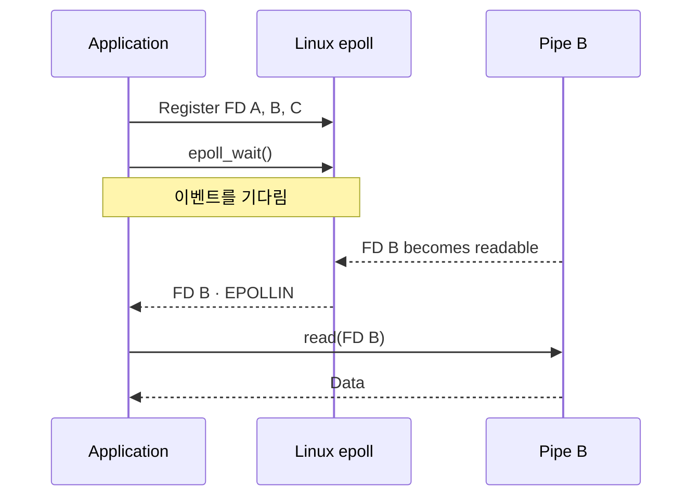

05편에서는 Pipe와 `subprocess`를 이용해 부모 프로세스와 자식 프로세스가 데이터를 주고받는 과정을 살펴봤다.

Pipe는 FD를 통해 접근할 수 있으며, 데이터를 읽는 쪽과 쓰는 쪽을 서로 다른 프로세스에 연결할 수 있다.

그런데 부모 프로세스가 여러 자식 프로세스를 실행하고, 각 자식의 stdout을 Pipe로 연결했다고 가정해 보자.

이때 첫 번째 자식 프로세스가 아직 데이터를 출력하지 않았다면 어떻게 될까?

부모 프로세스가 첫 번째 Pipe에서 `read()`를 호출하고 대기하는 동안, 두 번째 Pipe에는 이미 데이터가 도착했을 수도 있다.

하나의 I/O 작업이 완료되기를 기다리는 동안 다른 I/O 작업을 처리하지 못하는 문제가 발생하는 것이다.

이번 편에서는 Blocking과 Non-blocking I/O의 차이를 살펴보고, 운영체제가 여러 FD를 효율적으로 감시하기 위해 제공하는 I/O Multiplexing과 Linux의 `epoll`을 알아본다.

마지막으로 이러한 메커니즘이 Event Loop와 어떻게 연결되는지 살펴본다.

---

## 1. Blocking I/O는 무엇인가?

Blocking I/O는 I/O 작업을 수행할 수 없는 상황에서 호출한 실행 흐름이 작업을 진행할 수 있을 때까지 대기하는 방식이다.

05편에서 사용했던 `os.read()`를 다시 살펴보자.

```python
import os

read_fd, write_fd = os.pipe()

data = os.read(read_fd, 100)
```

이 코드에서는 Pipe를 생성했지만 아직 데이터를 기록하지 않았다.

기본적인 Blocking 모드에서 `os.read()`를 호출하면 읽을 데이터가 도착할 때까지 대기한다.

이때 대기하는 것은 프로세스 전체라기보다 해당 시스템 호출을 실행한 스레드다.

단일 스레드 프로그램이라면 그 스레드가 대기하는 동안 다음 Python 코드를 실행할 수 없다.

다른 스레드가 존재한다면 해당 스레드는 별도로 실행될 수 있다.

### 여러 Pipe를 읽는 경우

부모 프로세스가 두 개의 Pipe를 가지고 있다고 가정해 보자.

```python
data_a = os.read(pipe_a, 100)
data_b = os.read(pipe_b, 100)
```

첫 번째 Pipe에 데이터가 없다면 첫 번째 `read()`에서 대기할 수 있다.

그동안 두 번째 Pipe에 데이터가 도착하더라도 두 번째 `read()`는 아직 실행되지 않는다.

이것이 여러 I/O 작업을 순차적인 Blocking 호출로 처리할 때 발생할 수 있는 문제다.

물론 Blocking I/O 자체가 잘못된 방식은 아니다.

한 번에 하나의 작업을 처리하거나, 대기 중에 다른 작업을 수행할 필요가 없다면 단순하고 적절한 선택일 수 있다.

문제는 여러 I/O 자원을 하나의 실행 흐름에서 함께 처리해야 하는 상황이다.

---

## 2. Non-blocking I/O는 무엇인가?

Non-blocking I/O는 I/O 작업을 즉시 수행할 수 없는 상황에서 완료될 때까지 기다리는 대신, 현재 작업을 진행할 수 없다는 결과를 반환하는 방식이다.

Linux에서는 FD에 `O_NONBLOCK` 플래그를 설정해 Non-blocking 모드로 사용할 수 있다.

Python에서는 `os.set_blocking()`을 통해 이를 설정할 수 있다.

```python
import os

read_fd, write_fd = os.pipe()

os.set_blocking(read_fd, False)

try:
    data = os.read(read_fd, 100)
except BlockingIOError:
    print("아직 읽을 데이터가 없습니다.")

os.close(read_fd)
os.close(write_fd)
```

읽을 데이터가 없는 상태에서 Non-blocking `read()`를 호출하면, Python에서는 일반적으로 `BlockingIOError`가 발생한다.

Linux 시스템 호출 수준에서는 이러한 상황을 `EAGAIN` 또는 `EWOULDBLOCK` 오류로 표현한다.

Non-blocking I/O의 장점은 하나의 I/O 작업 때문에 실행 흐름이 멈추지 않는다는 것이다.

하지만 새로운 문제가 생긴다.

### 데이터를 언제 다시 읽어야 할까?

다음과 같은 코드를 생각해 보자.

```python
while True:
    try:
        data = os.read(read_fd, 100)
        break
    except BlockingIOError:
        pass
```

이 코드는 데이터가 도착할 때까지 계속 `read()`를 시도한다.

대기 때문에 멈추지는 않지만, 데이터를 읽을 수 있는지 반복해서 확인하느라 CPU 시간을 낭비할 수 있다.

이처럼 상태를 반복해서 확인하는 방식을 Polling이라고 한다.

여기서 필요한 것은 각 FD에 계속 `read()`를 호출하는 것이 아니라, **읽을 준비가 된 FD가 무엇인지 운영체제에 물어보는 방법**이다.

---

## 3. I/O Multiplexing은 무엇인가?

I/O Multiplexing은 하나의 실행 흐름에서 여러 FD의 I/O 준비 상태를 감시하는 방식이다.

예를 들어 부모 프로세스가 세 개의 Pipe를 가지고 있다고 가정해 보자.

```text
Parent Process
    |
    +-- Pipe A
    |
    +-- Pipe B
    |
    +-- Pipe C
```

각 Pipe에서 순서대로 Blocking `read()`를 호출하면 첫 번째 Pipe에서 대기할 수 있다.

반면 I/O Multiplexing을 사용하면 운영체제에 여러 FD를 감시하도록 요청할 수 있다.


<details>
<summary>다이어그램 원본 보기 (Mermaid)</summary>

```text
flowchart TB
    subgraph USER["User Space"]
        APP["Python Application\nFD B Ready"]
    end

    subgraph KERNEL["Kernel Space"]
        EP["epoll\nWatching FD A · FD B · FD C"]
        PA["Pipe A\nFD A"]
        PB["Pipe B\nFD B · Ready"]
        PC["Pipe C\nFD C"]
    end

    PA --- EP
    PB --- EP
    PC --- EP
    EP -->|"FD B Ready"| APP

    style PB stroke-width:3px
```

</details>

운영체제는 감시 중인 FD의 상태를 확인하고, 요청한 I/O 작업을 수행할 준비가 된 FD를 알려준다.

애플리케이션은 그 결과를 이용해 해당 FD에서 실제 읽기나 쓰기 작업을 수행한다.

여기서 중요한 점은 운영체제가 데이터를 대신 읽어서 Python에 전달하는 것이 아니라는 것이다.

일반적인 Readiness 기반 I/O Multiplexing은 **어떤 FD에서 I/O 작업을 진행할 수 있는지 알려주는 메커니즘**이다.

실제 데이터의 읽기와 쓰기는 애플리케이션이 수행한다.

Unix 계열 운영체제에서는 이러한 기능을 제공하는 인터페이스로 `select()`, `poll()` 등이 있다.

Linux에서는 `epoll`도 제공한다.

---

## 4. Linux의 epoll은 어떻게 동작하는가?

`epoll`은 Linux에서 여러 FD의 I/O 준비 상태를 효율적으로 감시하기 위해 제공하는 인터페이스다.

기본적인 사용 과정은 다음과 같다.

1. `epoll_create1()` 등으로 epoll 인스턴스를 생성한다.
2. `epoll_ctl()`로 감시할 FD와 관심 있는 이벤트를 등록한다.
3. `epoll_wait()`로 준비된 이벤트가 발생할 때까지 기다린다.
4. 반환된 이벤트를 확인하고 해당 FD에서 I/O 작업을 수행한다.

예를 들어 세 개의 Pipe를 감시하도록 등록했다면, 특정 Pipe에 데이터가 도착했을 때 `epoll_wait()`는 해당 FD에 읽기 이벤트가 발생했음을 알려줄 수 있다.



이 그림에서 `epoll`은 별도의 프로세스가 아니라 Linux 커널이 제공하는 기능이다.

또한 `epoll_wait()` 자체는 이벤트가 없다면 대기할 수 있다.

따라서 epoll을 사용한다고 해서 모든 시스템 호출이 Non-blocking으로 동작하는 것은 아니다.

핵심은 개별 FD에서 무작정 대기하는 대신, 여러 FD 중 작업을 진행할 수 있는 대상을 한 번에 기다릴 수 있다는 점이다.

### Readiness와 Completion의 차이

epoll이 알려주는 것은 I/O 작업의 완료가 아니라 준비 상태(Readiness)다.

예를 들어 `EPOLLIN` 이벤트는 해당 FD에서 읽기 작업을 진행할 수 있는 상태임을 나타낸다.

애플리케이션은 이벤트를 받은 후 직접 `read()`를 호출해야 한다.

또한 준비 상태가 보고되었다고 해서 이후의 모든 읽기 작업이 Blocking 없이 완료된다는 보장은 없다.

이벤트를 받은 뒤 다른 스레드가 데이터를 먼저 읽거나, 준비된 데이터보다 더 많이 읽으려고 할 수도 있기 때문이다.

따라서 epoll과 함께 FD를 Non-blocking 모드로 설정하는 방식이 널리 사용된다.

참고로 Linux epoll은 Pipe와 Socket 등의 FD를 감시할 수 있지만, 일반적인 디스크 파일은 epoll 감시 대상으로 지원되지 않는다.

---

## 5. Python에서 여러 FD 감시하기

Python의 `selectors` 모듈은 운영체제에서 제공하는 I/O Multiplexing 인터페이스를 공통된 API로 사용할 수 있게 해 준다.

Linux에서는 실행 환경에 따라 `EpollSelector`가 사용될 수 있다.

다음 예제에서는 두 개의 Pipe를 생성하고, 어느 Pipe에 데이터가 도착했는지 확인한다.

```python
import os
import selectors

selector = selectors.DefaultSelector()

read_a, write_a = os.pipe()
read_b, write_b = os.pipe()

try:
    os.set_blocking(read_a, False)
    os.set_blocking(read_b, False)

    selector.register(read_a, selectors.EVENT_READ, data="Pipe A")
    selector.register(read_b, selectors.EVENT_READ, data="Pipe B")

    os.write(write_b, b"Hello from Pipe B!")

    events = selector.select(timeout=1.0)

    for key, mask in events:
        if mask & selectors.EVENT_READ:
            data = os.read(key.fd, 1024)
            print(f"{key.data}: {data!r}")

finally:
    selector.close()

    for fd in (read_a, write_a, read_b, write_b):
        os.close(fd)
```

실행 결과는 다음과 같다.

```text
Pipe B: b'Hello from Pipe B!'
```

여기서는 Pipe A와 Pipe B를 모두 감시 대상으로 등록했다.

하지만 데이터를 기록한 것은 Pipe B뿐이다.

따라서 `selector.select()`는 Pipe B에서 읽기 작업을 진행할 수 있다는 이벤트를 반환한다.

이후 애플리케이션은 해당 FD에서 직접 `os.read()`를 호출한다.

`selectors.DefaultSelector`는 현재 운영체제에서 사용할 수 있는 적절한 구현을 선택한다.

따라서 이 예제는 Linux 전용 epoll API를 직접 호출하지 않으면서도 I/O Multiplexing의 기본 동작을 확인할 수 있다.

---

## 6. Event Loop는 이 구조를 어떻게 활용하는가?

지금까지는 운영체제가 여러 FD의 준비 상태를 감시하는 방법을 살펴봤다.

그렇다면 애플리케이션은 준비된 FD를 확인한 뒤 어떤 작업을 수행해야 할까?

이 과정을 반복적으로 관리하는 구조가 Event Loop다.

Event Loop는 이벤트를 기다리고, 발생한 이벤트에 대응하는 작업을 실행하는 반복 구조다.

I/O 중심의 Event Loop를 단순화하면 다음과 같다.

```python
while True:
    events = wait_for_io_events()

    for event in events:
        handle_event(event)
```

여기서 `wait_for_io_events()`는 운영체제의 I/O Multiplexing 기능을 이용해 이벤트를 기다리는 부분에 해당한다.

`handle_event()`는 준비된 FD에서 데이터를 읽거나 쓰고, 그 결과에 따라 후속 작업을 수행하는 부분에 해당한다.

실제 Event Loop는 I/O 이벤트 외에도 타이머, 예약된 콜백, Task 실행 등 다양한 작업을 관리할 수 있다.

### asyncio와의 관계

Python의 `asyncio`는 Event Loop를 기반으로 비동기 I/O 작업을 처리할 수 있도록 제공하는 라이브러리다.

예를 들어 다음 코드를 살펴보자.

```python
import asyncio

async def main():
    await asyncio.sleep(1)
    print("Done")

asyncio.run(main())
```

`await`는 현재 Coroutine이 기다려야 하는 작업을 표현하고, 실행을 일시 중단할 수 있는 지점을 제공한다.

이때 Event Loop는 실행 가능한 다른 Task가 있다면 해당 Task를 실행할 수 있다.

I/O를 기다리는 Task의 경우 Event Loop는 운영체제의 I/O 이벤트 감시 기능 등을 이용해 작업을 다시 진행할 시점을 판단할 수 있다.

다만 모든 `await`가 epoll 시스템 호출로 직접 이어지는 것은 아니다.

위 예제의 `asyncio.sleep()`은 타이머를 이용하며, 실제 Event Loop 구현도 운영체제와 실행 환경에 따라 달라질 수 있다.

이번 편에서 기억해야 할 관계는 다음과 같다.

```text
asyncio
   |
   v
Event Loop
   |
   v
I/O Multiplexing
   |
   v
epoll / select / 기타 OS 인터페이스
```

이 구조는 개념적인 관계를 단순화한 것이다. 예를 들어 Windows의 asyncio는 다른 방식의 I/O 이벤트 처리 메커니즘을 사용할 수 있다.

`asyncio`의 Task, Future, Coroutine이 실제로 어떻게 실행되는지는 별도의 Python 실행 원리에서 자세히 다룰 수 있다.

이번 편에서는 Event Loop가 여러 I/O 작업을 처리하기 위해 운영체제의 기능을 활용한다는 점에 집중한다.

---

## 7. 정리

이번 편에서는 여러 I/O 작업을 처리하기 위한 운영체제의 메커니즘을 살펴봤다.

핵심 내용을 정리하면 다음과 같다.

1. Blocking I/O는 작업을 진행할 수 없을 때 호출한 실행 흐름이 대기하는 방식이다.
2. Non-blocking I/O는 작업을 즉시 수행할 수 없을 때 대기하는 대신 현재 진행할 수 없다는 결과를 반환한다.
3. Non-blocking I/O를 반복해서 시도하는 방식은 불필요한 CPU 사용을 유발할 수 있다.
4. I/O Multiplexing은 여러 FD를 감시하고 작업을 진행할 준비가 된 FD를 알려주는 메커니즘이다.
5. Linux의 epoll은 여러 FD의 I/O 준비 상태를 감시하기 위한 인터페이스다.
6. Event Loop는 발생한 이벤트를 확인하고 그에 대응하는 작업을 실행하는 반복 구조다.

이제 하나의 실행 흐름에서 여러 Pipe나 Socket의 I/O를 처리할 수 있는 기본 원리를 이해했다.

지금까지 살펴본 내용을 종합하면, Python 프로그램은 다른 프로세스를 생성하고, 표준 입출력을 Pipe에 연결하고, 필요하다면 여러 I/O 통로를 감시할 수도 있다.

그렇다면 실제 MCP Client는 이러한 운영체제의 기능을 어떻게 활용해 MCP Server와 통신할까?

다음 편에서는 **MCP의 stdio 통신을 통해 지금까지 학습한 프로세스, FD, Pipe, I/O의 개념을 하나의 실행 구조로 연결**해 본다.
