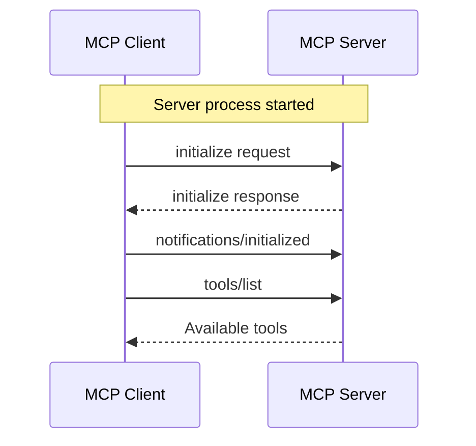
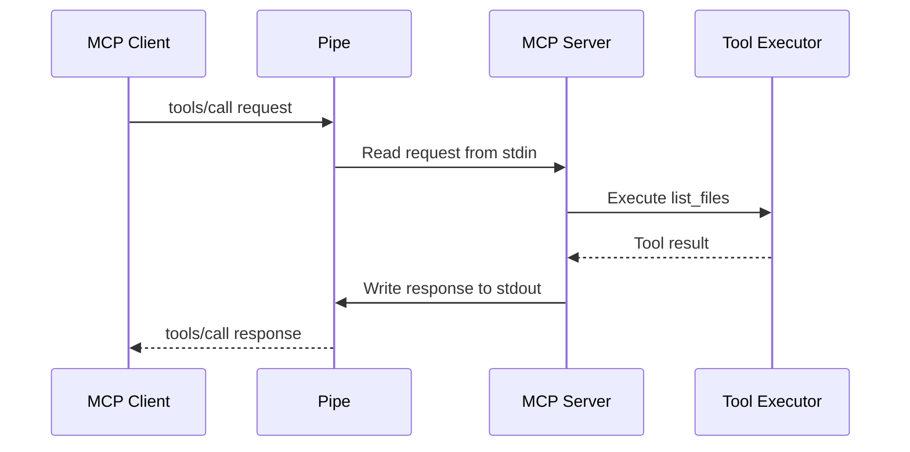
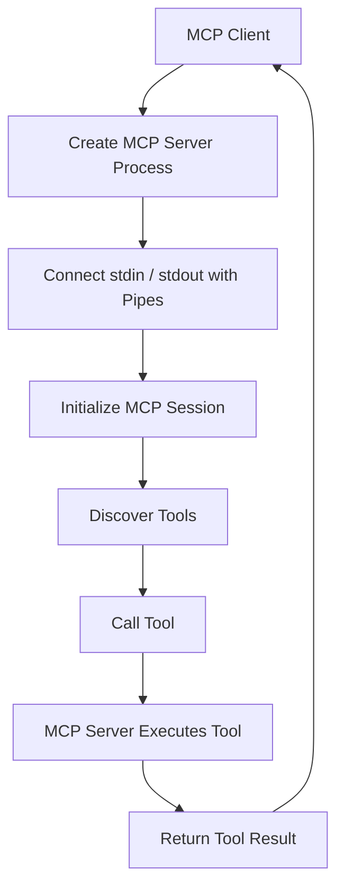

---

title: "07. MCP의 stdio 통신은 어떻게 동작하는가"
description: "Python의 프로세스 생성, File Descriptor, Pipe, 표준 입출력 개념을 바탕으로 MCP Client와 Server의 stdio 통신 및 Tool Calling 과정을 이해합니다."
pubDatetime: 2026-09-29T22:47:00+09:00
tags:

- Python
- Python으로 이해하는 운영체제
- MCP
- stdio
- Pipe
- JSON-RPC
draft: False

---

지금까지 Python 프로그램이 운영체제의 기능을 활용하는 과정을 단계별로 살펴봤다.

01편에서는 프로그램이 프로세스로 실행되는 과정을, 02편에서는 System Call을 통해 커널에 작업을 요청하는 방법을 알아봤다.

이후 File Descriptor, 표준 입출력, Pipe를 학습하면서 프로세스가 데이터를 읽고 쓰거나 다른 프로세스와 통신하는 구조를 이해했다.

06편에서는 여러 I/O 작업을 처리하기 위한 Non-blocking I/O, epoll, Event Loop도 살펴봤다.

이제 이러한 개념을 실제 사례에 적용해 보자.

다음 명령어는 Python으로 구현한 로컬 MCP 서버를 실행하는 예시다.

```bash
PYTHONPATH=src uv run python -m mcp_servers.code_tools_server
```

이 명령어를 실행하면 서버가 시작되지만, 터미널에는 아무것도 출력되지 않은 채 입력을 기다릴 수 있다.

일반적인 웹 서버와 달리 포트를 열었다는 메시지도 나타나지 않을 수 있다.

왜 이런 일이 발생할까?

이번 편에서는 MCP의 stdio 전송 방식을 통해 지금까지 학습한 운영체제 개념을 하나의 실행 구조로 연결한다.

---

## 1. MCP와 stdio는 각각 무엇을 담당하는가?

MCP(Model Context Protocol)는 AI 애플리케이션이 외부 도구와 데이터 등에 접근할 수 있도록 상호작용 방식을 정의하는 프로토콜이다.

MCP에서는 서버가 Tool 등의 기능을 제공하고, Client가 서버와 통신해 해당 기능을 사용할 수 있다.

예를 들어 코드 작업을 수행하는 AI 애플리케이션이 다음과 같은 Tool을 사용한다고 가정해 보자.

- `list_files`: 디렉터리의 파일 목록 조회
- `read_file`: 파일 내용 읽기
- `write_file`: 파일 내용 작성
- `run_command`: 명령어 실행

이러한 Tool을 MCP Server에 등록하면 MCP Client는 서버가 제공하는 Tool 목록을 조회하고 필요한 Tool을 호출할 수 있다.

여기서 MCP 메시지를 실제로 어떻게 전달할 것인지 결정하는 것이 전송 방식(Transport)이다.

MCP는 stdio 등의 전송 방식을 사용할 수 있다.

stdio는 Standard Input/Output의 약자로, 프로세스의 표준 입력과 표준 출력을 통해 메시지를 주고받는 방식이다.

따라서 MCP의 stdio 통신을 이해하려면 프로토콜과 전송 방식을 구분해야 한다.

| 구분       | 역할                                    |
| -------- | ------------------------------------- |
| MCP      | Client와 Server가 주고받는 메시지 및 상호작용 정의    |
| JSON-RPC | 요청, 응답, 알림을 표현하는 메시지 형식               |
| stdio    | 프로세스의 표준 입출력을 이용해 메시지를 전달하는 전송 방식     |
| Pipe     | 프로세스 사이에서 바이트 데이터를 전달하는 운영체제의 통신 메커니즘 |

MCP가 메시지의 의미와 형식을 정의한다면, stdio는 그 메시지를 전달하는 통로에 해당한다.

---

## 2. MCP Client는 Server를 어떻게 실행하는가?

로컬 stdio 환경에서는 일반적으로 MCP Client가 MCP Server를 자식 프로세스로 실행한다.

예를 들어 Client가 다음 명령어로 서버를 실행하도록 설정했다고 가정해 보자.

```bash
uv run python -m mcp_servers.code_tools_server
```

Client는 운영체제의 프로세스 생성 기능을 이용해 해당 명령어를 실행한다.

Python으로 이러한 구조를 구현한다면 05편에서 사용했던 `subprocess.Popen()`을 떠올릴 수 있다.

```python
import subprocess

process = subprocess.Popen(
    ["uv", "run", "python", "-m", "mcp_servers.code_tools_server"],
    stdin=subprocess.PIPE,
    stdout=subprocess.PIPE,
    stderr=subprocess.PIPE,
)
```

이 코드는 MCP Client의 실제 구현이 아니라, 프로세스 생성과 Pipe 연결을 설명하기 위한 예시다.

여기서는 부모 프로세스가 세 개의 Pipe를 통해 자식 프로세스의 표준 입력, 표준 출력, 표준 오류 출력을 각각 사용할 수 있도록 구성했다.

구조를 단순화하면 다음과 같다.

<div class="not-prose my-8 overflow-x-auto rounded-2xl" role="group" aria-label="MCP Client와 Server의 stdio 통신 아키텍처. 모바일에서는 가로로 스크롤할 수 있습니다.">


</div>

<details>
<summary>다이어그램 원본 보기 (Mermaid)</summary>

```text
flowchart LR
    subgraph Client["MCP Client · Parent Process"]
        CApp["Session + Tool UI"]
        CW["write FD · request stream"]
        CR["read FD · response stream"]
        CL["log reader / terminal"]
        CApp --> CW
        CR --> CApp
    end

    subgraph Kernel["Operating System Kernel"]
        PA["Pipe A Kernel Buffer<br/>Client → Server · one-way bytes"]
        PB["Pipe B Kernel Buffer<br/>Server → Client · one-way bytes"]
        LOG["Separate log channel<br/>optional Pipe or inherited stderr"]
    end

    subgraph Server["MCP Server · Child Process"]
        S0["FD 0 · stdin"]
        S1["FD 1 · stdout"]
        S2["FD 2 · stderr"]
        SApp["Protocol + Tools"]
        S0 --> SApp
        SApp --> S1
        SApp --> S2
    end

    Client -.->|"spawn child process"| Server
    CW -->|"initialize · tools/list · tools/call"| PA --> S0
    S1 -.->|"JSON-RPC responses"| PB -.-> CR
    S2 -.->|"non-protocol logs"| LOG -.-> CL

    P1["1 · Process creation"] --> P2["2 · Initialization"]
    P2 --> P3["3 · Tool Discovery"]
    P3 --> P4["4 · Tool Calling"]
    P4 --> P5["5 · Response"]
```

</details>

이 구조에서는 Client가 Server의 stdin에 데이터를 기록하고, Server의 stdout에서 데이터를 읽는다.

Server 입장에서는 Client가 어떤 방식으로 프로세스를 실행했는지 알 필요가 없다.

자신의 stdin에서 MCP 메시지를 읽고 stdout으로 응답하면 된다.

단, 이 그림의 stderr 연결은 예시다. 실제 Client는 stderr를 별도의 Pipe로 수집하거나, 로그를 다른 방식으로 처리할 수 있다.

---

## 3. stdin과 stdout은 어떻게 연결되는가?

04편에서는 표준 입출력이 관례적으로 다음 FD를 사용한다는 점을 살펴봤다.

| FD | 이름     | 역할       |
| -- | ------ | -------- |
| 0  | stdin  | 표준 입력    |
| 1  | stdout | 표준 출력    |
| 2  | stderr | 표준 오류 출력 |

MCP stdio 통신에서도 동일한 구조를 사용한다.

차이점은 각 FD가 터미널 대신 Pipe에 연결된다는 것이다.

### Client에서 Server로 메시지 전달

Client가 Server에 요청을 보내려면 Server의 stdin에 연결된 Pipe에 메시지를 기록한다.

데이터는 커널의 Pipe 버퍼를 거쳐 Server의 stdin으로 전달된다.

Server는 stdin에서 해당 데이터를 읽어 요청을 처리한다.

### Server에서 Client로 메시지 전달

Server가 요청을 처리한 뒤에는 stdout에 응답 메시지를 기록한다.

이 데이터는 반대 방향의 Pipe를 거쳐 Client에 전달된다.

Client는 자신의 Pipe 읽기 끝에서 응답을 읽는다.

따라서 Client와 Server는 서로의 메모리에 직접 접근하지 않고도 메시지를 주고받을 수 있다.

이 구조는 05편에서 살펴본 부모·자식 프로세스 간 양방향 Pipe 통신과 동일한 원리를 사용한다.

---

## 4. MCP 메시지는 어떤 형태로 전달되는가?

Pipe는 바이트 데이터를 전달하는 통로일 뿐이다.

Pipe 자체는 전달된 데이터가 Tool 호출인지, 일반 문자열인지 알지 못한다.

따라서 Client와 Server 사이에는 메시지 형식에 대한 약속이 필요하다.

MCP는 JSON-RPC 2.0을 기반으로 메시지를 교환한다.

JSON-RPC에는 크게 요청(Request), 응답(Response), 알림(Notification)이 있다.

예를 들어 Client가 서버의 Tool 목록을 요청한다고 가정해 보자.

```json
{
  "jsonrpc": "2.0",
  "id": 1,
  "method": "tools/list",
  "params": {}
}
```

이 메시지는 JSON-RPC 요청이다.

각 필드의 역할은 다음과 같다.

| 필드        | 의미               |
| --------- | ---------------- |
| `jsonrpc` | JSON-RPC 버전      |
| `id`      | 요청과 응답을 연결하는 식별자 |
| `method`  | 실행할 MCP 메서드      |
| `params`  | 메서드에 전달할 매개변수    |

Server는 요청을 처리한 뒤 동일한 `id`를 포함하는 응답을 반환한다.

```json
{
  "jsonrpc": "2.0",
  "id": 1,
  "result": {
    "tools": [
      {
        "name": "list_files",
        "description": "List files in a directory",
        "inputSchema": {
          "type": "object",
          "properties": {
            "path": {
              "type": "string"
            }
          },
          "required": ["path"]
        }
      }
    ]
  }
}
```

이 예시는 Tool 목록 응답의 구조를 단순화한 것이다.

stdio 전송에서는 각각의 JSON-RPC 메시지를 한 줄의 JSON으로 직렬화하고 줄바꿈 문자로 구분한다.

따라서 JSON 데이터 자체에 여러 줄의 들여쓰기를 적용해 전송하는 것이 아니라, 한 메시지를 한 줄로 전달한다.

이렇게 하면 수신 측은 입력 스트림에서 한 줄씩 읽어 개별 메시지로 해석할 수 있다.

---

## 5. MCP Client와 Server의 초기화 과정

Client가 Server 프로세스를 실행했다고 해서 즉시 Tool을 호출하는 것은 아니다.

먼저 MCP 초기화 과정이 필요하다.

일반적인 흐름은 다음과 같다.

1. Client가 Server 프로세스를 실행한다.
2. Client가 `initialize` 요청을 보낸다.
3. Server가 지원하는 프로토콜 버전과 기능 등을 응답한다.
4. Client가 `notifications/initialized` 알림을 보낸다.
5. 이후 Client가 `tools/list` 등의 요청을 통해 서버의 기능을 조회한다.

이를 시퀀스 다이어그램으로 표현하면 다음과 같다.



이때 모든 요청과 응답은 앞서 살펴본 stdin·stdout Pipe를 통해 전달된다.

초기화 과정에서 Client와 Server는 프로토콜 버전과 지원 기능 등을 확인한다.

따라서 프로세스가 정상적으로 실행되었다는 사실과 MCP 초기화가 성공했다는 사실은 구분해야 한다.

프로세스가 실행 중이더라도 Client가 초기화 메시지를 보내지 않았다면 Server는 계속 입력을 기다리고 있을 수 있다.

---

## 6. 실제 Tool Calling은 어떻게 이루어지는가?

초기화가 완료되고 Client가 Tool 목록을 확인했다면, 이제 Tool을 호출할 수 있다.

예를 들어 Client가 `list_files`를 호출한다고 가정해 보자.

```json
{
  "jsonrpc": "2.0",
  "id": 2,
  "method": "tools/call",
  "params": {
    "name": "list_files",
    "arguments": {
      "path": "."
    }
  }
}
```

Server는 요청을 수신하고 등록된 Tool을 실행한다.

Tool 실행이 완료되면 결과를 JSON-RPC 응답으로 반환한다.

```json
{
  "jsonrpc": "2.0",
  "id": 2,
  "result": {
    "content": [
      {
        "type": "text",
        "text": "main.py\nREADME.md"
      }
    ]
  }
}
```

이 과정에서 MCP Server 내부의 Tool 실행 로직은 일반적인 Python 코드로 구현할 수 있다.

예를 들어 `list_files`가 `os.listdir()`를 사용한다면, 실제 파일 목록 조회 과정에서 운영체제의 파일 시스템 기능을 활용하게 된다.

전체 흐름은 다음과 같다.



여기서 Pipe는 메시지를 전달하는 역할만 수행한다.

Tool의 권한 검사, 사용자 승인, 실제 실행 및 오류 처리 등은 MCP Server나 이를 사용하는 애플리케이션의 설계에 따라 별도의 계층에서 처리할 수 있다.

MCP는 Tool을 호출하기 위한 상호작용 방식을 제공하지만, 애플리케이션의 모든 실행 정책을 대신 결정하지는 않는다.

---

## 7. MCP Server는 왜 실행 후 아무것도 출력하지 않는가?

다음 명령어를 다시 살펴보자.

```bash
PYTHONPATH=src uv run python -m mcp_servers.code_tools_server
```

stdio 기반 MCP Server는 일반적으로 stdin으로 들어오는 메시지를 기다린다.

따라서 터미널에서 서버를 직접 실행하면 아무런 출력 없이 대기하는 것처럼 보일 수 있다.

이는 서버가 정상적으로 시작되어 입력을 기다리는 상황일 수 있다.

하지만 아무런 출력이 없다는 사실만으로 MCP 서버가 정상적으로 동작한다고 확정할 수는 없다.

실제로 연결과 초기화가 성공했는지 확인하려면 MCP Client를 통해 서버를 실행하고, 초기화와 Tool Discovery를 수행해 봐야 한다.

### stdout에 로그를 출력하면 안 되는 이유

stdio 기반 MCP 통신에서는 stdout을 프로토콜 메시지 전송에 사용한다.

따라서 다음과 같은 코드는 문제가 될 수 있다.

```python
print("MCP Server started!")
```

이 문자열이 stdout에 출력되면 Client는 이를 MCP 메시지로 해석하려고 할 수 있다.

하지만 일반 문자열은 올바른 JSON-RPC 메시지가 아니므로 통신 오류가 발생할 수 있다.

따라서 서버의 일반 로그와 디버깅 메시지는 stderr에 출력하는 것이 적절하다.

```python
import sys

print("MCP Server started!", file=sys.stderr)
```

Python의 `logging` 모듈을 사용할 때도 로그가 stdout이 아닌 stderr 등 별도의 통로로 전달되도록 구성해야 한다.

즉, stdio 기반 MCP Server에서는 표준 출력과 표준 오류 출력의 역할을 명확하게 구분해야 한다.

- stdout: MCP 프로토콜 메시지
- stderr: 로그 및 진단 메시지

04편에서 stdout과 stderr를 별도의 FD로 구분한 이유가 실제 MCP 서버 구현에서 중요해지는 지점이다.

---

## 8. Event Loop는 MCP stdio 통신에서 어떤 역할을 하는가?

06편에서는 여러 FD의 I/O 준비 상태를 감시하는 I/O Multiplexing과 Event Loop를 살펴봤다.

MCP Client는 여러 서버를 실행하거나 여러 I/O 작업을 처리해야 할 수 있다.

이때 Event Loop를 사용하면 각 서버의 응답을 기다리는 동안 다른 작업을 진행할 수 있다.

Python에서는 `asyncio`를 이용해 비동기 프로세스 통신을 구현할 수 있다.

예를 들어 다음 코드는 자식 프로세스를 비동기로 실행하고 표준 출력을 읽는 기본적인 예시다.

```python
import asyncio
import sys

async def main():
    process = await asyncio.create_subprocess_exec(
        sys.executable,
        "-c",
        "print('Hello from child')",
        stdout=asyncio.subprocess.PIPE,
    )

    stdout, _ = await process.communicate()

    print(stdout.decode())

asyncio.run(main())
```

이 코드는 MCP 통신을 구현한 것은 아니지만, 비동기 프로세스 생성과 Pipe를 통한 출력 수집이 어떻게 이루어지는지 보여준다.

실제 MCP Client는 이러한 비동기 I/O 메커니즘을 활용해 서버와 메시지를 주고받을 수 있다.

다만 MCP stdio 통신을 위해 반드시 epoll이나 특정 Event Loop를 직접 구현해야 하는 것은 아니다.

사용하는 MCP SDK와 실행 환경이 필요한 프로세스 생성 및 I/O 처리를 제공할 수 있다.

개발자는 그 위에서 MCP의 초기화, Tool Discovery, Tool Calling 등의 기능을 구현하거나 활용할 수 있다.

---

## 9. 전체 실행 구조 정리

지금까지 학습한 내용을 하나의 실행 흐름으로 정리해 보자.



각 단계는 이번 시리즈에서 다뤘던 운영체제 개념과 연결된다.

| 실행 단계               | 관련 개념                                          |
| ------------------- | ---------------------------------------------- |
| Server 프로세스 생성      | Process, `fork()` / `execve()` 등의 프로세스 실행 메커니즘 |
| 표준 입출력 연결           | FD Table, stdin, stdout, stderr                |
| Client와 Server 간 통신 | Pipe, IPC                                      |
| 메시지 송수신             | `read()`, `write()`, System Call               |
| 여러 I/O 작업 처리        | Non-blocking I/O, Event Loop                   |
| Tool 실행             | Python 코드와 운영체제 기능                             |

결국 MCP stdio 통신은 완전히 새로운 운영체제 기능을 사용하는 것이 아니다.

운영체제가 이미 제공하는 프로세스 생성, FD, Pipe, I/O 기능을 기반으로 MCP 프로토콜의 메시지를 주고받는 구조다.

---

## 10. 시리즈 마무리

이번 시리즈에서는 운영체제의 기본 개념에서 출발해 실제 MCP stdio 통신이 이루어지는 과정까지 살펴봤다.

01편에서는 프로그램이 프로세스로 실행되는 과정을 이해했고, 02편에서는 System Call을 통해 운영체제에 작업을 요청하는 방법을 알아봤다.

03편에서는 File Descriptor와 FD 테이블을 통해 프로세스가 I/O 자원을 참조하는 구조를 살펴봤으며, 04편에서는 표준 입출력과 I/O Redirection을 학습했다.

05편에서는 Pipe와 `subprocess`를 통해 프로세스 간 통신을 구현했고, 06편에서는 여러 I/O 작업을 처리하기 위한 I/O Multiplexing과 Event Loop의 기본 원리를 알아봤다.

마지막으로 이번 편에서는 이러한 개념을 MCP의 stdio 전송 방식에 적용했다.

이제 다음과 같은 명령어를 실행했을 때 어떤 일이 일어나는지 설명할 수 있다.

```bash
PYTHONPATH=src uv run python -m mcp_servers.code_tools_server
```

Python으로 구현한 MCP Server가 프로세스로 실행되고, MCP Client는 서버의 stdin과 stdout을 Pipe로 연결해 JSON-RPC 메시지를 주고받는다.

서버는 Client의 요청을 기다리다가 Tool 호출 메시지를 받으면 해당 Tool을 실행하고, 결과를 stdout으로 반환한다.

이것이 지금까지 살펴본 운영체제 개념들이 MCP의 stdio 통신으로 연결되는 과정이다
